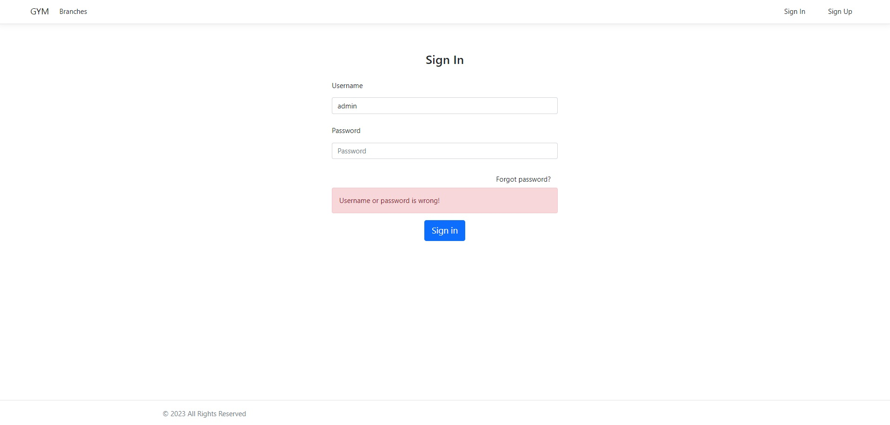
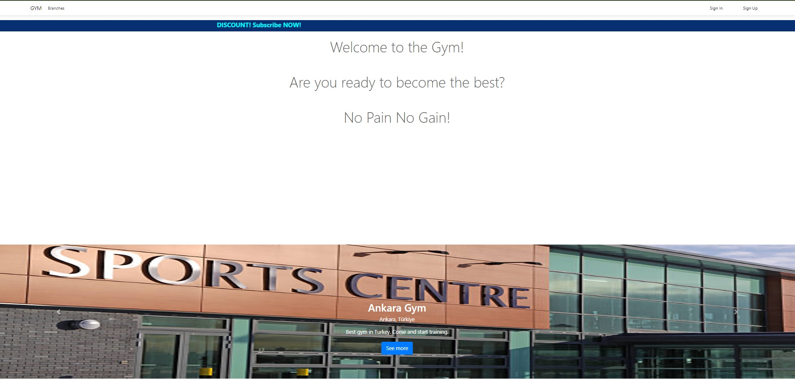
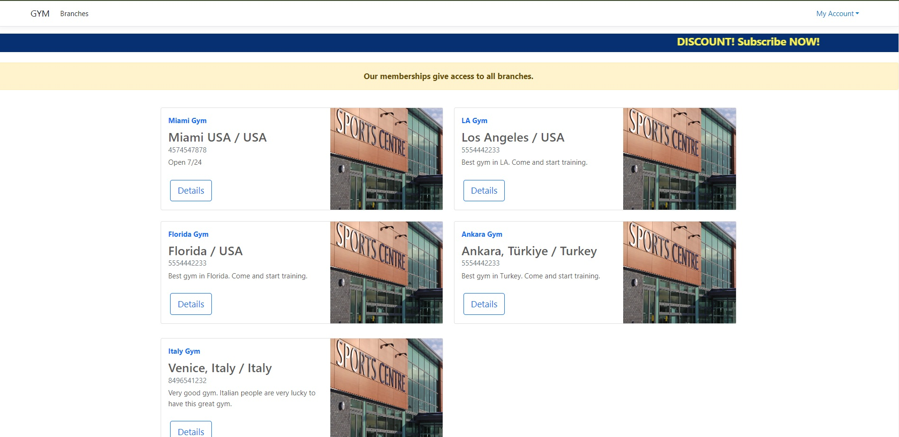
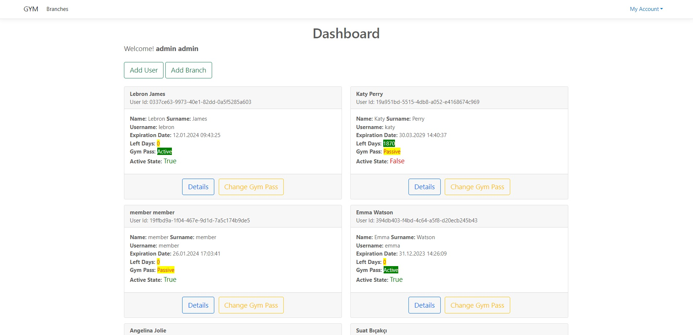
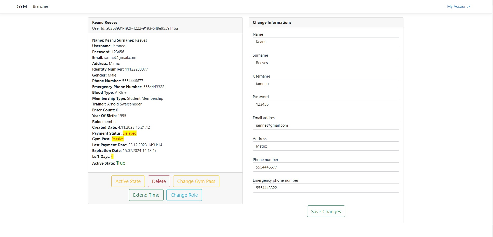
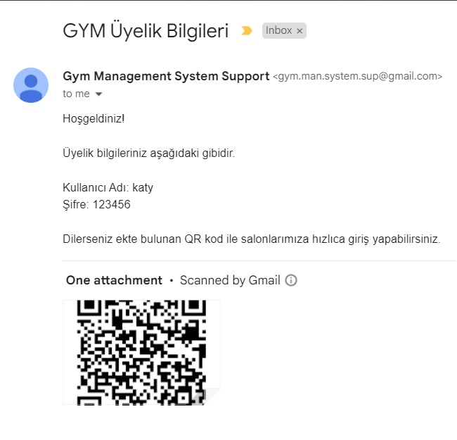

# Gym Management System

A project to manage the gyms and gym members. 
Users can sign up via web and gain access to all gyms.  
When a user sign up an email is sent to user. Email includes user informations and a QR Code that let users make a quick pass to gym. 
(QR Code process repo: https://github.com/VelatDicleli/gym_qr_code_passing_system)  

  </img>
  </img>
  </img>
  </img>
  </img>
  </img>

